# [CoT-RAG: Integrating Chain of Thought and Retrieval-Augmented Generation](https://arxiv.org/pdf/2504.13534)

## 摘要

> 提出一套整合知識圖譜引導、案例感知檢索與虛擬程式碼指令執行的 CoT-RAG 框架，能在多種推理任務中顯著提升準確度

## 盲區

- **決策樹** 並非機器學習的模型，僅僅是自行設計的結構
- **RAG** 直接銜接知識圖譜，並未有向量資料庫

## 研究動機與背景

- 現有的思維鏈（CoT）推理方法**過於依賴模型自主生成步驟**，容易產生事實**幻覺**或邏輯跳躍
- 自然語言提示詞在處理嚴謹邏輯時，**表現常遜於程式碼形式的提示詞**，但**程式碼對一般使用者門檻過高**

## 框架

### 1. Knowledge Graph-driven CoT Generation

> 初始化 / 更新 DT

1. 專家預建立[決策樹](https://github.com/hustlfy123/CoT-RAG/tree/main/data/DecisionTree)，僅離線建構一次
    - 父節點與子節點之間具有明確定義的邏輯關係
        - 父節點代表較一般化或前置性的問題
        - 父節點中的資訊與推理結果會傳遞給子節點
        - 藉此協助子節點完成問題求解 (儘管答案可能用不到)

    > 未闡述任何建立原則

    - 格式：
        
        | 欄位 | 說明 |
        | ---------- | ------- |
        | `Question` | 題目敘述 |
        | `Knowledge case` | 解題敘述 |

        > 然後[內文](https://arxiv.org/pdf/2504.13534)與[原碼](https://github.com/hustlfy123/CoT-RAG)**完全**沒看到

2. 再由 LLM 分解成數個實體 (文中與 repo 皆未詳述數量，已知為動態)，實體再組成具推理依賴關係的知識圖譜
    - 知識圖譜： `<實體1, 提供答案, 實體2>`，表示 `實體1` 提供答案予 `實體2`
    - 實體屬性：
        | 欄位              | 說明                                                 |
        | ----------------- | --------------------------------------------------- |
        | `sub_question`    | 將原始複雜問題拆解後得到的簡化組成部分                                 |
        | `sub_case`        | 從決策樹節點的「知識案例 (Knowledge Case)」中提取出的簡潔範例                              |
        | `sub_description` | 對應子問題的文本描述。**初始值為空**，後續由使用者查詢中提取的資訊與其他實體的「答案」進行賦值 |
        | `answer`          | LLM 對子問題輸出的推理結果。**初始值為空**，直到第三階段才會生成                   |
    
        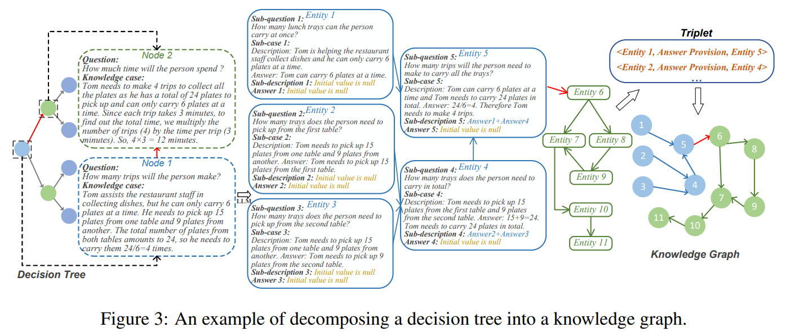

    - 分解後的部分實體[內容](https://github.com/hustlfy123/CoT-RAG/blob/main/data/DecisionTree/Expert-A/AQuA/DT.txt) (開放資料 AQuA)：
        ```
        0
        Sub-question 1: "What are the rates of Friend P and Friend Q in relation to each other?"
        Sub-question 2 (Parent node: Sub-question 1): "What is the combined rate of both friends as they walk towards each other?"
        Sub-question 3 (Parent node: Sub-question 2): "How long will it take for Friend P and Friend Q to meet?"
        Sub-question 4 (Parent node: Sub-question 3): "How far will Friend P walk in the time it takes for them to meet?"
        
        1
        Sub-question 1: "What is the equation of line k given that it passes through the origin and has a slope of 1/5?"
        Sub-question 2 (Parent node: Sub-question 1): "How can the coordinates (x, 1) be substituted into the equation of line k to find the value of x?"
        Sub-question 3 (Parent node: Sub-question 1): "How can the coordinates (5, y) be substituted into the equation of line k to find the value of y?"
        Sub-question 4 (Parent node: Sub-question 2): "What is the specific value of x after substituting (x, 1) into the line k equation?"
        Sub-question 5 (Parent node: Sub-question 3): "What is the specific value of y after substituting (5, y) into the line k equation?"
        
        ...
        ```
        樹狀圖呈現
        ```
        0
        Q1: What are the rates of Friend P and Friend Q in relation to each other?
        └─ Q2: What is the combined rate of both friends as they walk towards each other?
        └─ Q3: How long will it take for Friend P and Friend Q to meet?
            └─ Q4: How far will Friend P walk in the time it takes for them to meet?
        
        1
        Q1: What is the equation of line k given that it passes through the origin and has a slope of 1/5?
        ├─ Q2: How can the coordinates (x, 1) be substituted into the equation of line k to find the value of x?
        │  └─ Q4: What is the specific value of x after substituting (x, 1) into the line k equation?
        └─ Q3: How can the coordinates (5, y) be substituted into the equation of line k to find the value of y?
        └─ Q5: What is the specific value of y after substituting (5, y) into the line k equation?
        
        ...
        ```
    
        > 文中提及 `... Distinct from traditional DTs, each node in our DT contains a Question and a Knowledge case...`
        
        > `Knowledge case` ???

3. 產生 初始「虛擬程式知識圖譜」(PKG，pseudo-program knowledge graph)

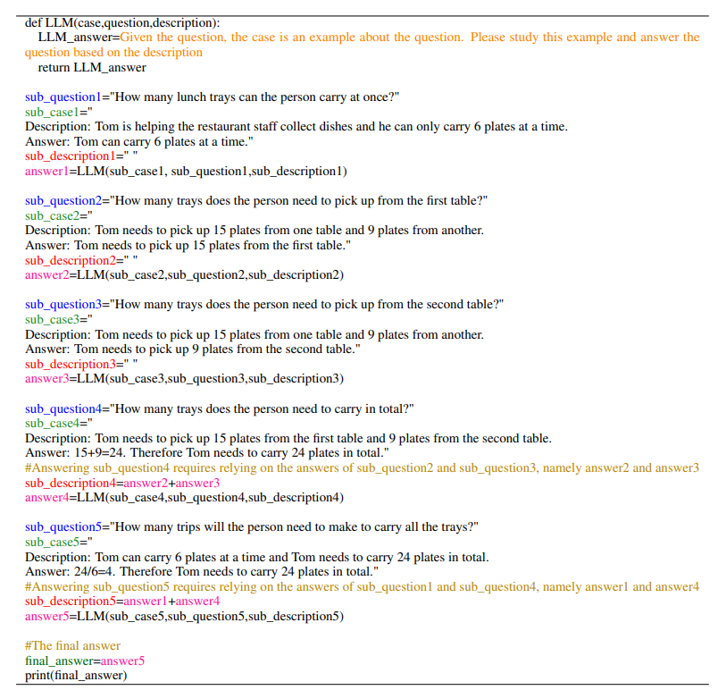

> "Given the question, the case is an example about the question. Please study this example and answer the question based on the description"

> "給定問題，而案例為與問題相關的範例。請研究範例，並根據描述回答問題。"

### 2. Learnable Knowledge Case-aware RAG

> 針對使用者提出的具體問題進行檢索 (or 更新) 圖譜

1. LLM 從使用者輸入提取對應的子描述 (Sub-descriptions)
2. 檢索圖譜結果的 sub_question、sub_case 與子描述 (Sub-descriptions) 針對「虛擬程式知識圖譜」對應實體屬性填值，更新「虛擬程式知識圖譜」(此時轉為 updated_PKG)

| 更新前 | 更新後 |
| :-: | :-: |
|  | 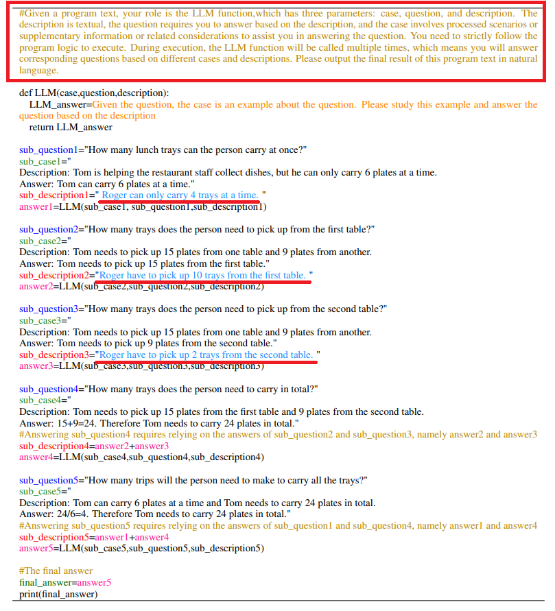 |

> "#Given a program text, your role is the LLM function,which has three parameters: case, question, and description. The
description is textual, the question requires you to answer based on the description, and the case involves processed scenarios or
supplementary information or related considerations to assist you in answering the question. You need to strictly follow the
program logic to execute. During execution, the LLM function will be called multiple times, which means you will answer
corresponding questions based on different cases and descriptions. Please output the final result of this program text in natural
language."

> "#給定一段程式文本，你的角色是一個 LLM 函式，其具有三個參數：case、question 與 description。description 為文字描述內容，question 需要你根據 description 進行回答，而 case 則包含經處理的情境、補充資訊或相關考量，以協助你回答問題。你必須嚴格遵循程式邏輯來執行。在執行過程中，LLM 函式會被多次呼叫，這代表你需要根據不同的 case 與 description 回答相應問題。請以自然語言輸出此程式文本的最終結果。
"

> **上頭追加一段提示詞之外，欄位 'Sub-descriptions' 也填具內容**

### 3. Pseudo-Program Prompting Execution

> LLM 仿程式碼執行「虛擬程式知識圖譜」

1. LLM 執行「虛擬程式知識圖譜」(updated_PKG)

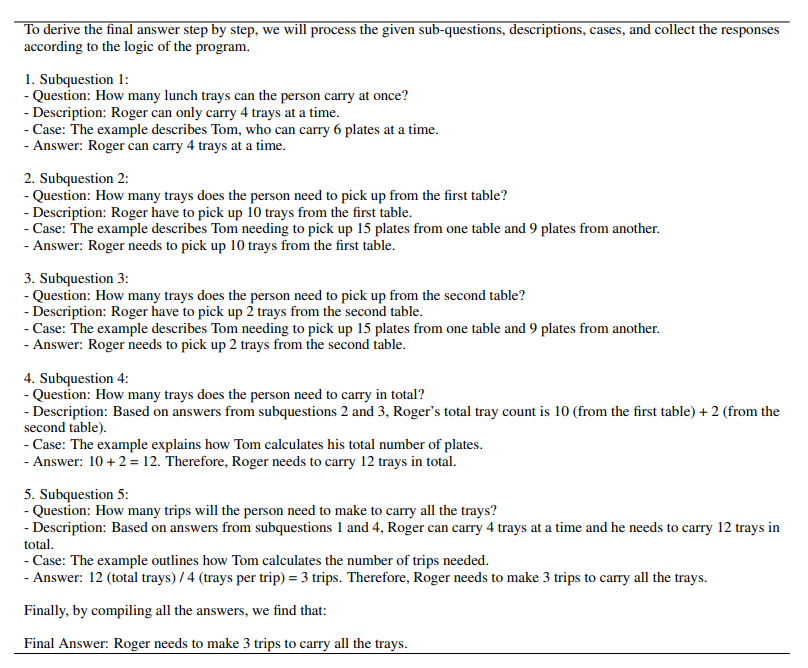

### 4. 系統架構

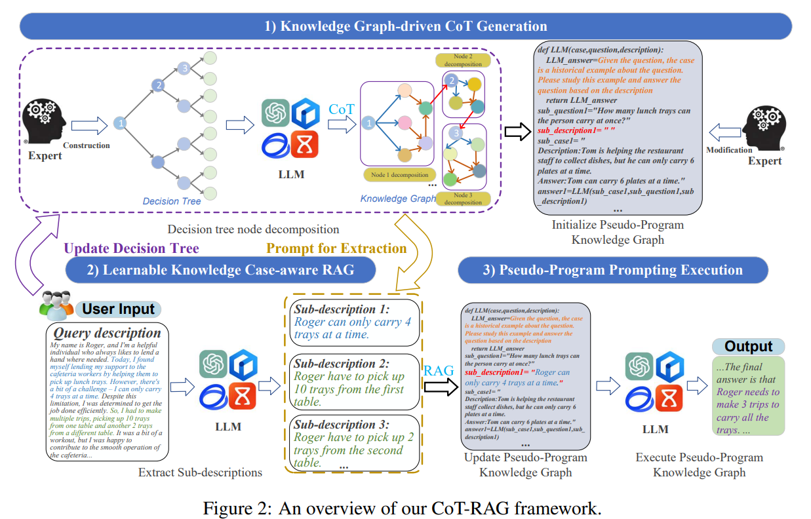

## 實驗

### 實驗內容

| 項目                |   數量 |
| ------------------ | ---: |
| 通用領域 (開放資料庫)          |  9 種 |
| 垂直領域 (開放資料庫)          |  4 種 |
| 對比 CoT 方法          | 13 種 |
| Faiss 向量資料庫索引      |  6 種 |
| LLM-based RAG 系統架構 |  8 種 |
| LLM 模型             |  5 種 |

---

- 通用領域 (9)
    
    | 類別   | 資料集                       | 主要用途      |
    | ---- | ------------------------- | --------- |
    | 算術推理 | AQUA                      | 數學與算術推理   |
    | 算術推理 | GSM8K                     | 國小數學文字題推理 |
    | 算術推理 | MultiArith                | 多步驟算術問題   |
    | 算術推理 | SingleEq                  | 單方程式求解    |
    | 常識推理 | HotpotQA                  | 多跳問答推理    |
    | 常識推理 | CSQA                      | 常識推理      |
    | 常識推理 | SIQA                      | 社會情境理解    |
    | 符號推理 | Last Letter Concatenation | 字串與符號推理   |
    | 符號推理 | Coin Flip                 | 狀態追蹤與邏輯推理 |

- 垂直領域 (4)

    | 領域      | 資料集              | 主要用途        |
    | ------- | ---------------- | ----------- |
    | 法律      | LawBench（LaB）    | 法律推理與問答     |
    | 法律      | LegalBench（LeB）  | 法律文本理解與推理   |
    | 金融      | CFBenchmark（CFB） | 金融知識推理      |
    | 邏輯 / 綜合 | AGIEval（AGI）     | 高階推理與綜合能力評估 |

- 對照的 CoT 方法 (13)

    > 依年份降冪排序，同年僅併排

    | 方法            | 年份    | 核心概念                             |
    | ------------- | ----- | -------------------------------- |
    | ZEUS          | 2025  | 以不確定性估計選擇示範案例                    |
    | Pattern-CoT   | 2025  | 使用 reasoning patterns 強化推理       |
    | QDMRPS        | 2024a | 將問題拆解為 DAG 進行推理                  |
    | Iter-CoT      | 2024a | 透過 iterative bootstrapping 修正推理鏈 |
    | KG-CoT        | 2024  | 使用 KG 圖推理生成顯式推理路徑                |
    | Complex-CoT   | 2023  | 以範例選擇機制支援多步推理                    |
    | Auto-CoT      | 2023  | 自動生成高品質 prompt                   |
    | PS            | 2023a | 先規劃再求解                           |
    | KD-CoT        | 2023  | 結合檢索器與非結構化知識                     |
    | IRCoT         | 2023  | 推理與知識檢索交錯進行                      |
    | Manual-CoT    | 2022  | 使用 thought chain 提示，引導逐步推理       |
    | Zero-shot-CoT | 2022  | 加入「Let’s think step by step」觸發推理 |
    | Zero-shot     | —     | 僅輸入原始問題，不使用額外方法                  |

- Faiss 向量資料庫索引 (6)

    > 若 RAG 改採連接向量資料庫 Faiss，檢視**索引資料方式**差異

    | 方法 | 核心概念 | 速度 | 精度 | 記憶體 |
    | ------- | ------------ | --- | -- | --- |
    | FlatL2 | 全比對 | 慢 | 最高 | 大 |
    | FlatIP | 全比對 cosine 類 | 慢 | 最高 | 大 |
    | IVFFlat | 分群後搜尋 | 快 | 高 | 中 |
    | LSH | Hash bucket | 很快 | 中低 | 小 |
    | PQ | 向量壓縮 | 快 | 中 | 很小 |
    | IVFPQ | 分群+壓縮 | 非常快 | 中 | 很小 |
    | No expert | 無專家決策樹 (LLM 自產) | X | X | X |

- LLM-based RAG 系統架構 (8)

    > 依年份降冪排序，同年僅併排

    | 方法        | 年份    | 核心概念                                    |
    | --------- | ----- | --------------------------------------- |
    | ToG-2     | 2025  | 利用 KG 的 entity 連結進行知識導向檢索            |
    | PoG       | 2025  | 整合 KG 推理路徑提升 LLM 推理能力                 |
    | RoG       | 2024  | 先規劃 KG 關係路徑，再擷取推理路徑                |
    | Graph-CoT | 2024  | 在圖結構上進行迭代推理                            |
    | RRKG      | 2024  | 結合可解釋 KG 與 LLM 強化複雜推理                 |
    | AtomR     | 2024  | 原子層級的異質知識推理框架                        |
    | GraphRAG  | 2024  | 結合 RAG、query-focused summarization 與 KG |
    | ToG       | 2024b | 使用 iterative beam search 尋找最佳 KG 推理路徑   |

- 選用 LLM (5)
    
    > 依年份降冪排序，同年僅併排

    > temperature=0, max token=1000
    
    | 模型               | 開發單位    | 年份    | 特點            |
    | ---------------- | ------- | ----- | -------------- |
    | ERNIE-Speed-128K | Baidu   | 2025  | 支援 128K 長上下文處理 |
    | ERNIE-3.5-128K   | Baidu   | 2025  | ERNIE 系列長文本模型  |
    | GLM-4-flash      | ZhipuAI | 2025  | 高速、輕量化推理       |
    | GPT-4o mini      | OpenAI  | 2024b | 輕量版多模態模型       |
    | GPT-4o           | OpenAI  | 2024a | 完整多模態大型語言模型  |

### 實驗結果

- Accuracy on **nine datasets**

    > 同表格序位

    - ERNIE-Speed-128K

    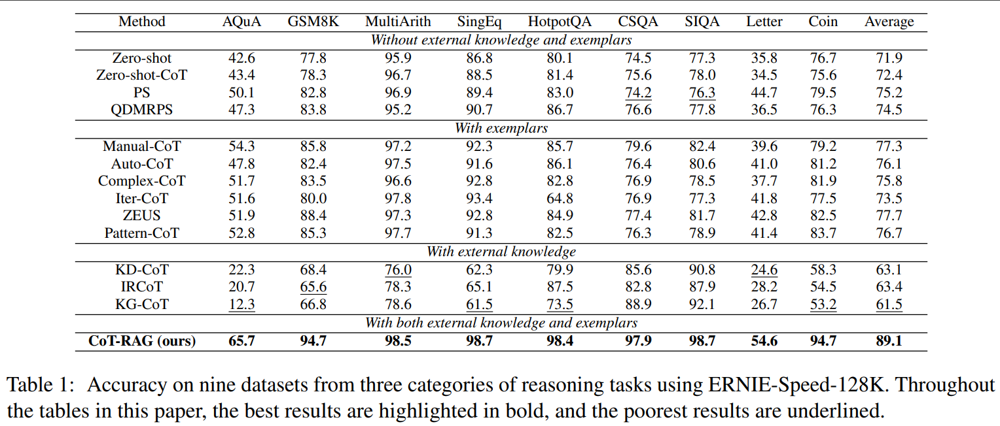

    - ERNIE-3.5-128K

    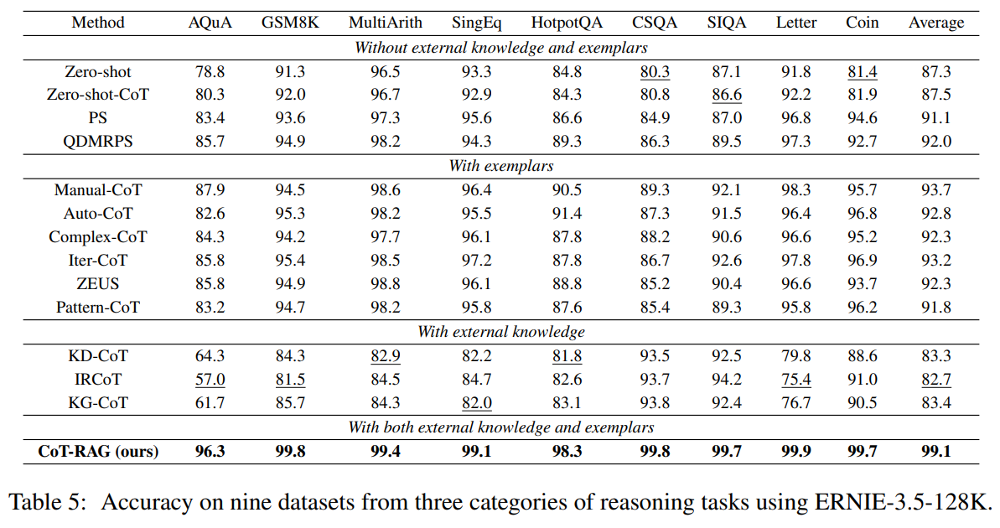

    - GLM-4-flash

    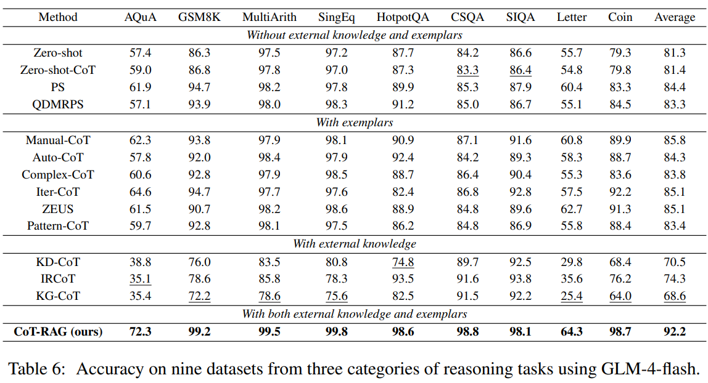

    - GPT-4o mini

    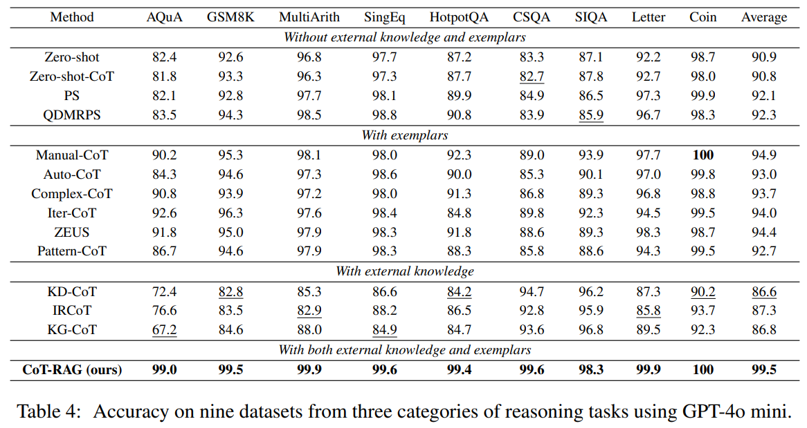

    - GPT-4o

    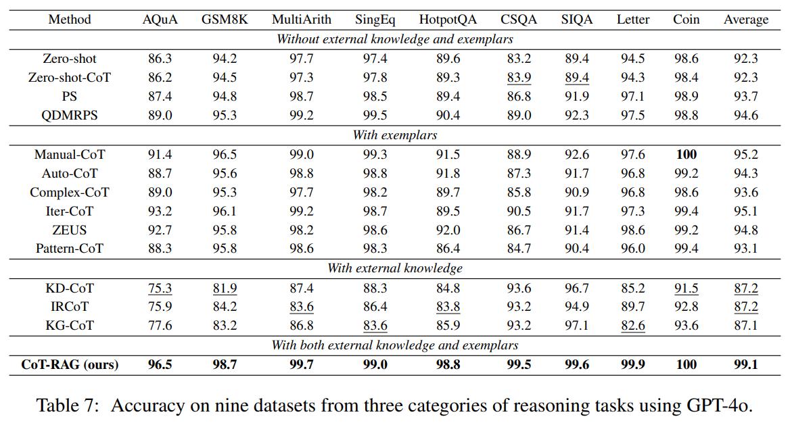

- Runtime (sec.) on **nine datasets**

    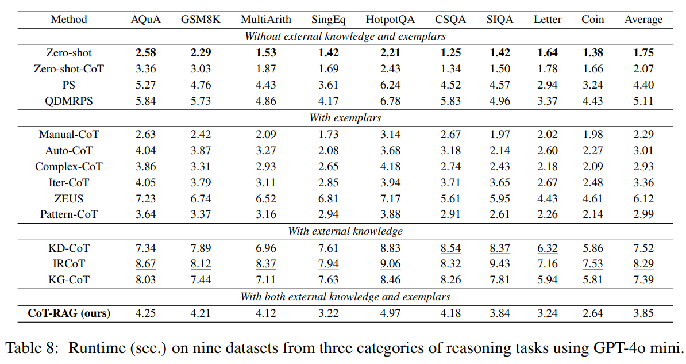

-  **vertical domains**
    - GPT-4o mini
        - Accuracy on four datasets

        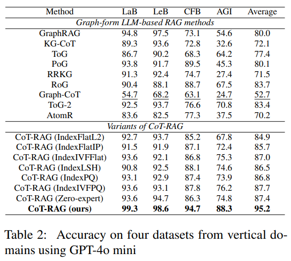

        - Runtime and token

        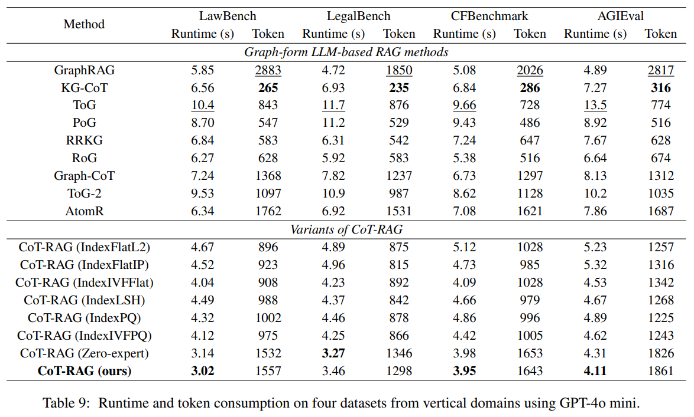

### 結論

- 實驗結果顯示 CoT-RAG 在所有測試集上準確率平均提升 4.0% 至 44.3%
- 垂直領域測試中，該框架顯著降低錯誤率
- 受限於高階模型（如 GPT-4）以及初始決策樹人力構建成本
- 分解實體數量在超過 5 個之後，所有方法 Accuracy 皆開始驟降
- 以 GPT-4o mini 參考下 (非最新模型)，垂直領域表現最佳

### 後記

- 原始碼內未見，決策樹節點的 `Knowledge case` 去哪了?
- PKG 內的實體填具數量如何決定?
- 執行時間偏高，但消耗 token 量也相對高
- 實體之間傳遞答案，也許用不上，僅是同類題目而已
